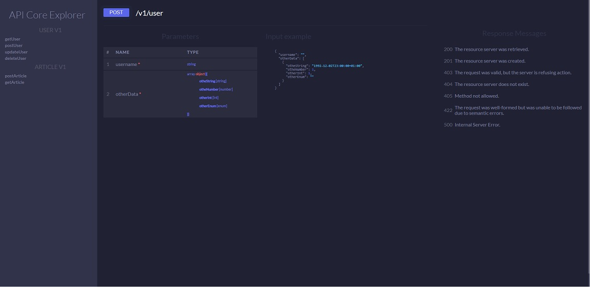

Guía de Instalación
====

**Requerimientos**
- Node >= v8.0.0
- npm  >=  v5.0.0
- pm2  >=  2.6.1

Ir a la carpeta del proyecto para instalar las librerias
```sh
$ yarn install
```

Instalar pm2 en modo global 
```sh
$ sudo npm install pm2 -g
```

# Ejecutar la aplicación
Crear el archivo de configuracion ecosystem.local.yml para pm2 o se puede usar directamente ecosystem.example.yml
```js
pm2 start ecosystem.example.yml --env development	
```

```js
pm2 start ecosystem.example.yml --env production	
```

Luego abra un navegador y vaya a [localhost:3232/explorer](localhost:3232/explorer) para ver el explorador de rutas.




Con Docker
=============================


**Requerimientos**
- Docker
- Docker-compose

**Ir a la carpeta del proyecto y construir las imagenes de docker**

```sh
$ docker-compose build
```

**Configurar el archivo docker-compose con las variables que se usaran:**
```sh
$ docker-compose up -d
```

Estructura de la aplicacion
=======

Files：
```
.
├── app 
│   └── controllers                     // Los controladores se separan en carpetas de version
│   │   └── v1
│   │   │   └── nombreDelControlador.js // Cada controlador se debe llamar igual a como se le dio de alta en el archivo endpoints.js, igual con cada funcion dentro.
│   │   └── v2
│   └── db	
│   │   └── index.js                    // Contiene las funciones que se utilizan para crear la consulta a postgres
│   │   └── util.js                     // Solo es el archivo donde se crea la instancia del conector node-postgres usando config.js
│   └── middleware	
│   │   └── conditionalParameters.js    // Sirve para validar que dentro de un grupo de parametros que al menos uno se envie, 
│   │   └── error.js                    // Personaliza la respuesta  que se da ante un error
│   │   └── parameter.js                // Encargado de la validacion de parametros GET o POST
│   └── routes
│   │   └── endpoints.js                // IMPORTANTE, es aqui donde se configuran las rutas y parametros que ocupan
│   │   └── index.js                    // Se da de alta la instancia de router de koa con los parametros del archivo endpoints.js ya procesadas
│   └── views                           // index del explorador
├── public                              // Archivos css, js o imagenes
├── app.js                              // Inicia toda esta madre
├── config.js                           // Archivo con las variables que utiliza la aplicacion
├── docker-compose.yml                  // Archivo de configuracion para iniciar las imagenes de Docker 
├── Dockerfile                          // Contruye la imagen Docker para este proyecto
├── ecosystem.example.yml               // Archivo de ejemplo de configuracion para pm2
└── package.json 												
```

**endpoints.js**

Para dar de alta un endpoint nuevo


```js

// Ejemplo "/v1/nombreControlador/nombreFuncion"

{
	v1: {
		nombreControlador:{
			nombreFuncion:{
				verb:"POST, GET, PUT or DELETE",
				verifyParams:{
					nombreDelParametro: { type: 'int, string...', required: false },
					... : {...} 
				}
			}, ... : {...} 
		}, ... : {...} 
	},
	v2: {...} 
}

```

Logs
=======

```js
pm2 flush       // This will delete all log entries from every managed process, also the PM2 process.
pm2 reloadLogs  // If you’re using logrotate or any other application to support you handling the log entries, you can reload the old entries from your PM2 logs.
```

```js
ls -l --block-size=M

/home/{USER}/.pm2/logs/*.log

cat /home/user/.pm2/logs/api-koa-out-*.log | grep -i -C 30 "404"
```